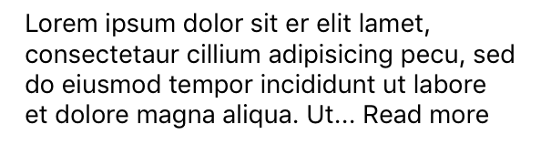

# ReadMoreTextView

UITextView subclass with "read more"/"read less" capabilities.

##Usage

	let textView = ReadMoreTextView()

	textView.text = "Lorem ipsum dolor ..."

	textView.shouldTrim = true
	textView.maximumNumberOfLines = 4
	textView.readMoreText = "... Read more"
	textView.readLessText = " Read less"

##Installation

Available in [Cocoa Pods](https://github.com/CocoaPods/CocoaPods):

	pod 'ReadMoreTextView'

##License

ReadMoreTextView is available under the [MIT license](http://www.opensource.org/licenses/mit-license.php).
